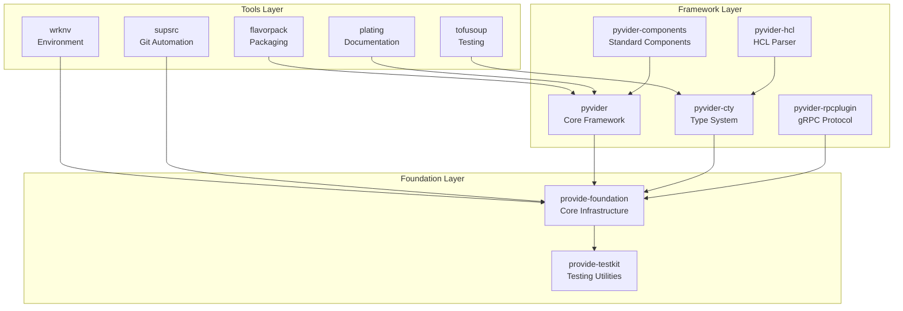

# Welcome to the Provide Foundry

The Provide Foundry is a comprehensive collection of Python tools and frameworks designed to make building Terraform providers, packaging applications, and managing development workflows both powerful and enjoyable.

<div class="grid cards" markdown>

-   :fontawesome-solid-rocket:{ .lg .middle } **Get Started Quickly**

    ---

    Set up the entire foundry with a single command and start building providers in minutes.

    [:octicons-arrow-right-24: Getting Started](getting-started.md)

-   :fontawesome-solid-cubes:{ .lg .middle } **Modular Architecture**

    ---

    Built as composable layers from foundation to tools, with clear separation of concerns.

    [:octicons-arrow-right-24: Architecture](foundry/architecture.md)

-   :fontawesome-solid-code:{ .lg .middle } **Developer First**

    ---

    Type-safe, well-documented APIs with excellent error messages and debugging support.

    [:octicons-arrow-right-24: API Reference](api/)

-   :fontawesome-solid-heart:{ .lg .middle } **Open Source**

    ---

    Apache 2.0 licensed with active development and community contributions welcome.

    [:octicons-arrow-right-24: Contributing](../CONTRIBUTING.md)

</div>

## What's in the Foundry?

### :material-foundation: Foundation Layer

Build on solid fundamentals with structured logging, testing utilities, and error handling.

- **[provide-foundation](packages/foundation.md)** - Core telemetry and logging infrastructure
- **[provide-testkit](packages/testkit.md)** - Testing utilities and fixtures for the foundry

### :material-terraform: Pyvider Framework

Create Terraform providers in Python with type safety and excellent developer experience.

- **[pyvider](packages/pyvider.md)** - Core framework for building Terraform providers
- **[pyvider-cty](packages/pyvider-cty.md)** - CTY type system implementation
- **[pyvider-hcl](packages/pyvider-hcl.md)** - HCL parsing with CTY integration
- **[pyvider-rpcplugin](packages/pyvider-rpcplugin.md)** - gRPC plugin protocol implementation
- **[pyvider-components](packages/pyvider-components.md)** - Standard components library

### :material-tools: Development Tools

Streamline your workflow with packaging, documentation, testing, and automation tools.

- **[flavorpack](packages/flavorpack.md)** - Create self-contained executable packages
- **[wrknv](packages/wrknv.md)** - Manage development environments
- **[plating](packages/plating.md)** - Generate documentation for providers
- **[tofusoup](packages/tofusoup.md)** - Cross-language conformance testing
- **[supsrc](packages/supsrc.md)** - Automated Git workflow management

## Quick Examples

### Create a Terraform Provider

```python
from pyvider import provider, resource, data_source
from pyvider.schema import Attribute

@provider
class MyProvider:
    """A simple example provider."""
    pass

@resource
class ExampleResource:
    """An example resource."""

    name: str = Attribute(
        description="The name of the resource",
        required=True
    )

    def create(self, config):
        # Implementation here
        return {"id": "example-123", "name": config.name}
```

### Package an Application

```bash
# Create a self-contained executable
flavor pack --manifest pyproject.toml --output myapp.psp

# Run the packaged application
./myapp.psp --help
```

### Set Up Development Environment

```bash
# Initialize environment with all tools
wrknv init --with-pyvider --with-testing

# Activate the environment
source workenv/env.sh
```

## Architecture Overview

The Provide Foundry follows a layered architecture designed for composability and maintainability:



## Why the Provide Foundry?

### :material-speedometer: **Performance First**
- Async-native architecture
- Efficient resource utilization
- Benchmarked and optimized critical paths

### :material-shield-check: **Type Safety**
- Full type annotations using modern Python 3.11+
- Runtime type validation
- Comprehensive error messages

### :material-test-tube: **Testing Excellence**
- Comprehensive test coverage
- Property-based testing with Hypothesis
- Cross-language conformance testing

### :material-cog: **Production Ready**
- Structured logging and observability
- Error handling and resilience patterns
- Security best practices

### :material-account-group: **Developer Experience**
- Excellent documentation
- Interactive examples
- Clear error messages
- AI assistant integration

## Community

### :material-github: **GitHub**
All development happens on GitHub with issues, discussions, and pull requests welcome.

[View on GitHub :octicons-arrow-right-24:](https://github.com/provide-io){ .md-button .md-button--primary }

### :material-chat: **Discussions**
Join the community discussion for questions, ideas, and collaboration.

[Join Discussions :octicons-arrow-right-24:](https://github.com/provide-io/discussions){ .md-button }

### :material-book-open: **Documentation**
Comprehensive guides, tutorials, and API documentation for every package.

[Explore Packages :octicons-arrow-right-24:](packages/){ .md-button }

---

Ready to start building? Check out our [Getting Started guide](getting-started.md) or dive into the [architecture overview](foundry/architecture.md).