# Packages Overview

The provide.io foundry consists of 13 interconnected packages organized into three distinct layers, plus workspace tooling for unified development. Each package is designed to be independently useful while working seamlessly with others in the foundry.

## Package Map

```mermaid
graph TB
    subgraph "🛠️ Tools Layer"
        FP[flavorpack<br/>🌶️📦 Packaging]
        WE[wrknv<br/>🧰🌍 Environment]
        PL[plating<br/>🍽️📖 Documentation]
        TS[tofusoup<br/>🥣🔬 Testing]
        SS[supsrc<br/>🔼⚙️ Git Automation]
    end

    subgraph "🏗️ Framework Layer"
        PY[pyvider<br/>🐍🏗️ Core Framework]
        CTY[pyvider-cty<br/>🌊🪢 Type System]
        HCL[pyvider-hcl<br/>📄⚙️ Configuration]
        RPC[pyvider-rpcplugin<br/>🔌📞 Protocol]
        COMP[pyvider-components<br/>🧩🔧 Components]
        TPP[terraform-provider-pyvider<br/>📦 Meta Package]
    end

    subgraph "🏛️ Foundation Layer"
        FOUND[provide-foundation<br/>🧱🏗️ Infrastructure]
        TEST[provide-testkit<br/>🧪✅ Testing]
    end

    classDef foundation fill:#e1f5fe,stroke:#01579b,stroke-width:2px
    classDef framework fill:#f3e5f5,stroke:#4a148c,stroke-width:2px
    classDef tools fill:#e8f5e8,stroke:#1b5e20,stroke-width:2px

    class FOUND,TEST foundation
    class PY,CTY,HCL,RPC,COMP,TPP framework
    class FP,WE,PL,TS,SS tools
```



## 🧰 Workspace Management

Tools for managing the complete provide.io ecosystem development environment.

<div class="grid cards" markdown>

-   **[provide-workspace](provide-workspace/)**

    Workspace manager that coordinates all 13+ ecosystem repositories for unified development with single-command setup.

    [:octicons-arrow-right-24: Learn more](provide-workspace/)

</div>

## 🏛️ Foundation Layer

The foundation layer provides core infrastructure that all other packages build upon.

<div class="grid cards" markdown>

-   **[provide-foundation](foundation/)**

    Core telemetry and logging infrastructure with emoji-enhanced structured logging, error handling, and configuration management.

    [:octicons-arrow-right-24: Learn more](foundation/)

-   **[provide-testkit](testkit/)**

    Comprehensive testing utilities and fixtures organized by domain (file, process, transport, crypto) for the entire foundry.

    [:octicons-arrow-right-24: Learn more](testkit/)

</div>

## 🏗️ Framework Layer

The framework layer implements the core abstractions for building Terraform providers in Python.

<div class="grid cards" markdown>

-   **[pyvider](pyvider/)**

    Core framework for building Terraform providers with decorators for providers, resources, data sources, and functions.

    [:octicons-arrow-right-24: Learn more](pyvider/)

-   **[pyvider-cty](pyvider-cty/)**

    Complete implementation of Terraform's CTY type system with Python-native APIs and cross-language compatibility.

    [:octicons-arrow-right-24: Learn more](pyvider-cty/)

-   **[pyvider-hcl](pyvider-hcl/)**

    HCL parsing and generation with CTY integration for processing Terraform configuration files.

    [:octicons-arrow-right-24: Learn more](pyvider-hcl/)

-   **[pyvider-rpcplugin](pyvider-rpcplugin/)**

    High-performance gRPC implementation of the Terraform plugin protocol with transport abstraction and security features.

    [:octicons-arrow-right-24: Learn more](pyvider-rpcplugin/)

-   **[pyvider-components](pyvider-components/)**

    Standard library of components including resources, data sources, and functions for common use cases.

    [:octicons-arrow-right-24: Learn more](pyvider-components/)

-   **[terraform-provider-pyvider](terraform-provider-pyvider/)**

    Official Pyvider provider demonstrating the framework capabilities and providing utility components.

    [:octicons-arrow-right-24: Learn more](terraform-provider-pyvider/)

</div>

## 🛠️ Tools Layer

The tools layer provides development and deployment utilities that enhance the development experience.

<div class="grid cards" markdown>

-   **[flavorpack](flavorpack/)**

    Progressive Secure Package Format (PSPF) implementation for creating self-contained, portable executable packages.

    [:octicons-arrow-right-24: Learn more](flavorpack/)

-   **[wrknv](wrknv/)**

    Work environment management tool that generates standardized development environments with tool version management.

    [:octicons-arrow-right-24: Learn more](wrknv/)

-   **[plating](plating/)**

    Documentation generation system for Terraform providers that extracts schemas and generates Terraform Registry-compliant docs.

    [:octicons-arrow-right-24: Learn more](plating/)

-   **[tofusoup](tofusoup/)**

    Cross-language conformance test suite for OpenTofu tooling with support for multiple harnesses and test types.

    [:octicons-arrow-right-24: Learn more](tofusoup/)

-   **[supsrc](supsrc/)**

    Automated Git commit/push utility that monitors filesystem events and performs Git operations based on configurable rules.

    [:octicons-arrow-right-24: Learn more](supsrc/)

</div>

## Package Dependencies

Understanding dependencies helps with choosing the right packages for your needs:

### Zero Dependencies
These packages have minimal external dependencies:
- **pyvider-cty**: Core type system (only msgpack, attrs)
- **wrknv**: Environment management (minimal dependencies)

### Foundation Dependencies
These packages build on the foundation layer:
- **pyvider**: Depends on provide-foundation
- **pyvider-hcl**: Depends on pyvider-cty and provide-foundation
- **pyvider-rpcplugin**: Depends on provide-foundation
- **flavorpack**: Depends on provide-foundation
- **supsrc**: Depends on provide-foundation

### Framework Dependencies
These packages build on the framework layer:
- **pyvider-components**: Depends on pyvider, pyvider-cty, pyvider-rpcplugin
- **plating**: Depends on pyvider and pyvider-cty
- **tofusoup**: Optional dependencies on pyvider packages

### Testing Dependencies
All packages use provide-testkit for testing:
- Provides unified testing utilities
- Domain-specific fixtures (file, network, crypto, etc.)
- Integration with pytest and hypothesis

## Installation Patterns

### Individual Package Installation

Install specific packages for focused use:

```bash
# Just the type system
uv add pyvider-cty

# Core framework only
uv add pyvider

# Packaging tools
uv add flavorpack
```

### Framework Installation

Install the complete framework for provider development:

```bash
# Core framework with components
uv add pyvider pyvider-components

# Full framework with all extras
uv add pyvider[all] pyvider-components[all]
```

### Complete Ecosystem

Install everything for foundry development:

```bash
# Clone the foundry
git clone https://github.com/provide-io/provide-workspace.git
cd provide-workspace

# Install all packages in editable mode
uv sync --extra all --extra dev
source .venv/bin/activate
```

## Version Compatibility

The foundry uses semantic versioning with coordinated releases:

| Release | Foundation | Framework | Tools | Status |
|---------|------------|-----------|--------|---------|
| 0.1.x   | 0.1.x     | 0.0.x     | 0.0.x  | Current |
| 0.2.x   | 0.2.x     | 0.1.x     | 0.1.x  | Planned |
| 1.0.x   | 1.0.x     | 1.0.x     | 1.0.x  | Future  |

### Compatibility Matrix

| Package | Python | Terraform | Status |
|---------|--------|-----------|---------|
| provide-foundation | 3.11+ | N/A | Stable |
| provide-testkit | 3.11+ | N/A | Alpha |
| pyvider | 3.11+ | 1.0+ | Alpha |
| pyvider-cty | 3.11+ | 1.0+ | Alpha |
| pyvider-hcl | 3.11+ | 1.0+ | Alpha |
| pyvider-rpcplugin | 3.11+ | 1.0+ | Alpha |
| pyvider-components | 3.11+ | 1.0+ | Alpha |
| flavorpack | 3.11+ | N/A | Alpha |
| wrknv | 3.11+ | N/A | Alpha |
| plating | 3.11+ | 1.0+ | Alpha |
| tofusoup | 3.11+ | 1.0+ | Alpha |
| supsrc | 3.11+ | N/A | Alpha |

## Package Metrics

### Lines of Code (Approximate)
- **provide-foundation**: ~15,000 LOC
- **pyvider**: ~12,000 LOC
- **pyvider-cty**: ~8,000 LOC
- **pyvider-rpcplugin**: ~6,000 LOC
- **flavorpack**: ~5,000 LOC
- **Other packages**: ~2,000-4,000 LOC each

### Test Coverage
All packages maintain high test coverage:
- **Target**: >80% coverage
- **Critical paths**: >95% coverage
- **Property-based testing**: Where applicable
- **Integration tests**: Cross-package functionality

### Documentation Coverage
- **API Reference**: Complete for all public APIs
- **Examples**: Working examples for all major features
- **Guides**: Step-by-step tutorials
- **Architecture**: Design documentation

---

Ready to dive deeper? Start with the [foundation layer](foundation/) or jump to the [framework overview](pyvider/) if you're building Terraform providers.